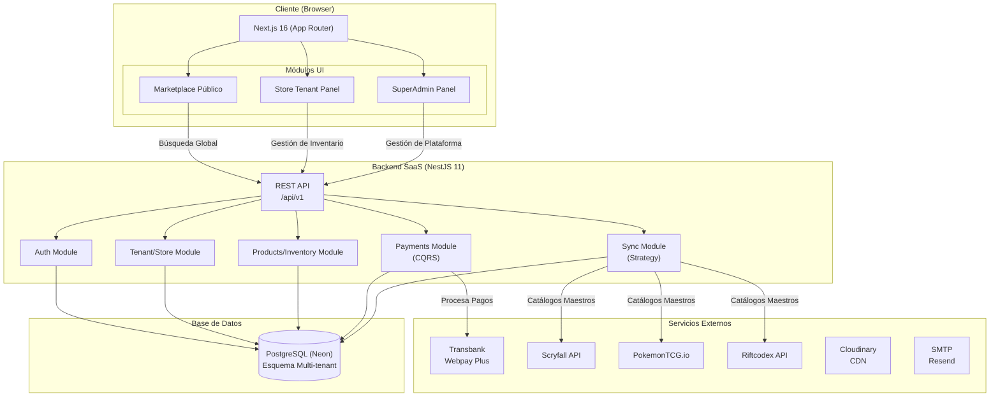
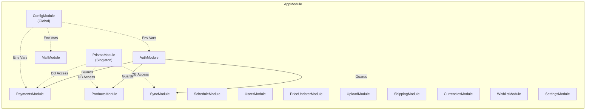
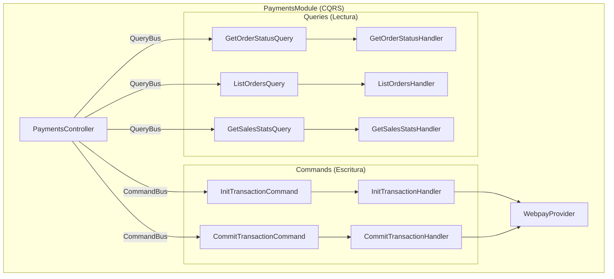
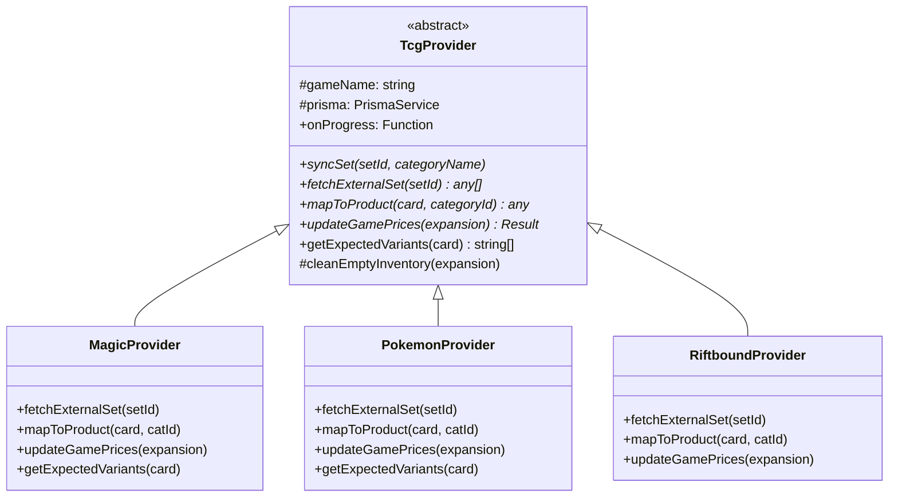
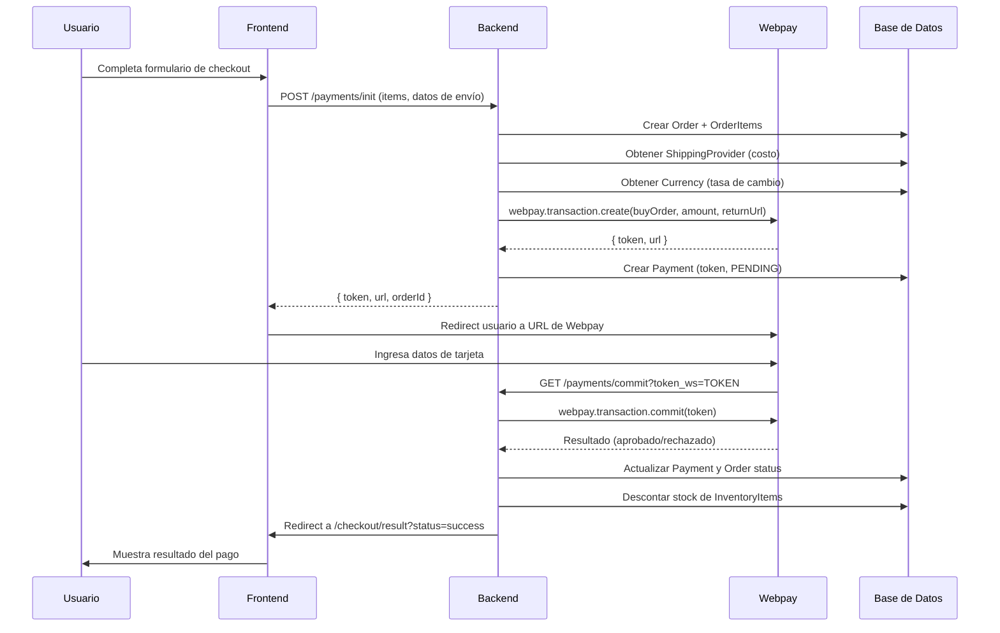
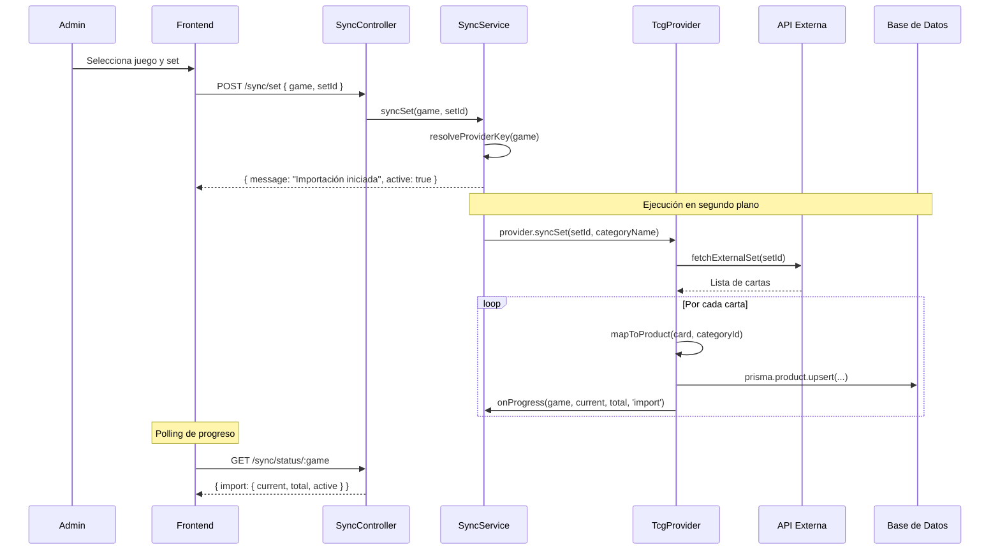
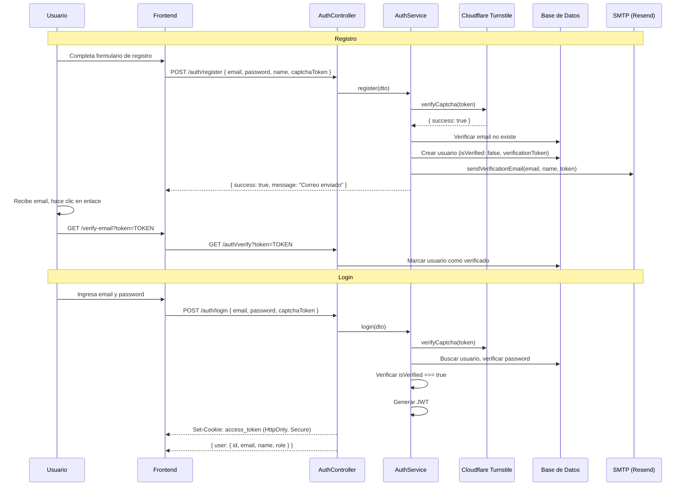
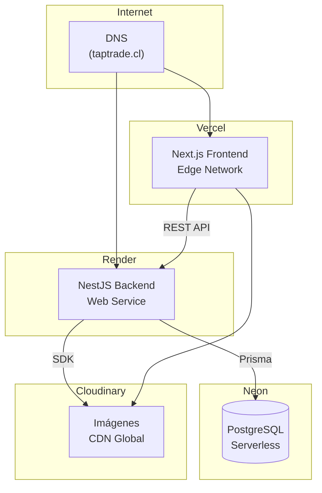

# 🏗️ Arquitectura del Sistema — TapTrade (SaaS Multi-tenant)

Este documento describe la arquitectura técnica, los patrones de diseño empleados, el modelo de datos y los flujos de operación de la plataforma SaaS y Marketplace B2B/B2C.

---

## Índice

1. [Vista General](#vista-general)
2. [Arquitectura de Módulos (Backend)](#arquitectura-de-módulos-backend)
3. [Patrones de Diseño](#patrones-de-diseño)
4. [Modelo de Datos](#modelo-de-datos)
5. [Flujos de Operación](#flujos-de-operación)
6. [Infraestructura](#infraestructura)
7. [Seguridad](#seguridad)
8. [Decisiones de Diseño](#decisiones-de-diseño)

---

## Vista General

El sistema se compone de una arquitectura SaaS Multi-tenant (Software as a Service) con un frontend unificado que actúa tanto como Marketplace para compradores, como Panel de Control para tiendas y administradores.



---

## Arquitectura de Módulos (Backend)

El backend sigue la **arquitectura modular de NestJS**, donde cada dominio de negocio está encapsulado en su propio módulo con controller, service y DTOs.



### Descripción de cada módulo

| Módulo | Responsabilidad | Dependencias Clave |
|:---|:---|:---|
| **ConfigModule** | Carga de variables de entorno (`.env`). Configurado como global. | — |
| **PrismaModule** | Singleton del cliente Prisma. Acceso a la base de datos para todos los módulos. | PostgreSQL (Neon) |
| **AuthModule** | Registro, login, logout, verificación de email. JWT + Passport. | UsersModule, MailModule, Cloudflare Turnstile |
| **UsersModule** | Perfil del usuario, actualización de datos, historial de pedidos. | PrismaModule |
| **ProductsModule** | CRUD de productos, categorías, marcas. Bulk upload CSV. Gestión de inventario (variantes). Filtros y paginación. | PrismaModule, UploadModule, SyncModule (MagicService) |
| **PaymentsModule** | Creación de órdenes, integración Webpay, confirmación de pagos, estadísticas de ventas. Usa patrón **CQRS**. | PrismaModule, WebpayProvider, MailModule |
| **SyncModule** | Motor de sincronización multi-TCG. Importación de sets desde APIs externas. Usa patrón **Strategy**. | PrismaModule, APIs externas |
| **PriceUpdaterModule** | Controlador para disparar actualizaciones de precios por expansión. Delega al SyncModule. | SyncModule |
| **MailModule** | Envío de emails transaccionales (verificación de cuenta). Templates HTML embebidos. | Nodemailer, SMTP (Resend) |
| **UploadModule** | Upload y eliminación de imágenes en Cloudinary. | Cloudinary SDK |
| **ShippingModule** | CRUD de proveedores de envío y sus tarifas. | PrismaModule |
| **CurrenciesModule** | CRUD de divisas y tasas de cambio. | PrismaModule |
| **WishlistModule** | Lista de deseos por usuario (agregar/eliminar productos). | PrismaModule |
| **SettingsModule** | Configuración global key-value (ej: destinos de sincronización por juego). | PrismaModule |

---

## Patrones de Diseño

### 1. CQRS (Command Query Responsibility Segregation)

Implementado en el módulo **Payments** usando `@nestjs/cqrs`. Separa las operaciones de escritura (Commands) de las de lectura (Queries).



**Por qué CQRS aquí:**
- Las operaciones de pago (init/commit) tienen efectos secundarios complejos (crear orden, llamar a Webpay, actualizar estado de pago).
- Las consultas de estadísticas son pesadas y podrían optimizarse independientemente.
- Facilita la trazabilidad y testing de cada operación.

### 2. Strategy Pattern — Motor de Sincronización TCG

El módulo **Sync** usa herencia con una clase abstracta `TcgProvider` que define el contrato para cada juego. Cada juego concreto implementa la lógica específica de su API.



Cada provider tiene un **Service** asociado que encapsula las llamadas HTTP a las APIs externas:

| Provider | Service | API Externa | Datos Obtenidos |
|:---|:---|:---|:---|
| `MagicProvider` | `MagicService` | Scryfall, MTGJSON | Cards, sets, precios |
| `PokemonProvider` | `PokemonService` | PokemonTCG.io | Cards, sets, precios |
| `RiftboundProvider` | `RiftboundService` | Riftcodex, JustTCG | Cards, sets, precios |

**Cómo agregar un nuevo juego:**
1. Crear `nuevo-juego.service.ts` con las llamadas HTTP a la API del juego.
2. Crear `nuevo-juego.provider.ts` extendiendo `TcgProvider`.
3. Registrar el provider en `SyncService.constructor`.
4. Agregar la categoría correspondiente en la base de datos.

### 3. Guard Pattern — Autorización por Roles

```typescript
@UseGuards(JwtAuthGuard, RolesGuard)
@Roles(Role.ADMIN)
```

Cadena de guards:
1. **JwtAuthGuard**: Verifica que el request tenga un JWT válido (cookie `access_token`).
2. **RolesGuard**: Verifica que el usuario tenga el rol requerido (`ADMIN` o `USER`).
3. **OptionalJwtAuthGuard**: Variante que permite acceso sin autenticación pero extrae el usuario si existe (usado en checkout para invitados).

### 4. Exception Filter — Manejo Global de Errores Prisma

`PrismaClientExceptionFilter` captura errores de Prisma y los traduce a respuestas HTTP apropiadas:

| Código Prisma | HTTP Status | Significado |
|:---|:---|:---|
| `P2002` | 409 Conflict | Violación de constraint único |
| `P2025` | 404 Not Found | Registro no encontrado |
| Otros | 500 Internal Server Error | Delegado al filtro base de NestJS |

---

## Modelo de Datos

### Diagrama Entidad-Relación

```mermaid
erDiagram
    Category ||--o{ Product : "has many"
    Brand ||--o{ Product : "has many"
    Product ||--o| CardDetail : "has one (optional)"
    Product ||--o{ InventoryItem : "has many"
    Product ||--o{ WishlistItem : "wishlisted by"

    Language ||--o{ InventoryItem : "used by"
    Condition ||--o{ InventoryItem : "used by"
    Finish ||--o{ InventoryItem : "used by"

    User ||--o{ WishlistItem : "has many"
    User ||--o{ Order : "places"

    Order ||--o{ OrderItem : "contains"
    Order ||--o| Payment : "has one"
    ShippingProvider ||--o{ Order : "ships"

    Category {
        string id PK
        string name UK
        string slug UK
        string imageUrl
        boolean isTcg
    }

    Brand {
        string id PK
        string name UK
        string imageUrl
    }

    Product {
        string id PK
        string externalId UK
        string name
        string description
        string imageUrl
        string categoryId FK
        string brandId FK
        datetime createdAt
        datetime updatedAt
    }

    CardDetail {
        string id PK
        string expansion
        string rarity
        string collectorNum
        string game
        string[] attributes
        string productId FK_UK
    }

    InventoryItem {
        string id PK
        string productId FK
        string conditionId FK
        string languageId FK
        string finishId FK
        decimal price
        int stock
    }

    Language {
        string id PK
        string name UK
        string code UK
    }

    Condition {
        string id PK
        string name UK
    }

    Finish {
        string id PK
        string name
        string game
        string[] aliases
    }

    User {
        string id PK
        string email UK
        string password
        string name
        string phone
        string address
        string city
        Role role
        boolean isVerified
        string verificationToken
    }

    Order {
        string id PK
        string buyOrder UK
        string userId FK
        string email
        string name
        decimal totalAmount
        string currencyCode
        decimal exchangeRate
        string shippingProviderId FK
        decimal shippingCost
        OrderStatus status
        datetime createdAt
    }

    OrderItem {
        string id PK
        string orderId FK
        string productId
        string inventoryItemId
        string productName
        int quantity
        decimal unitPrice
    }

    Payment {
        string id PK
        string orderId FK_UK
        string token UK
        PaymentStatus status
        decimal amount
        string authCode
        string cardLast4
        string paymentType
        int installments
        datetime transactionDate
    }

    WishlistItem {
        string userId PK_FK
        string productId PK_FK
        datetime createdAt
    }

    GlobalSetting {
        string id PK
        string key UK
        string value
    }

    Currency {
        string id PK
        string code UK
        string name
        string symbol
        decimal exchangeRate
        boolean isDefault
    }

    ShippingProvider {
        string id PK
        string name UK
        decimal price
        boolean isActive
    }
```

### Enumeraciones

| Enum | Valores |
|:---|:---|
| `Role` | `USER`, `ADMIN` |
| `OrderStatus` | `PENDING`, `PAID`, `FAILED`, `CANCELLED`, `REFUNDED` |
| `PaymentStatus` | `PENDING`, `AUTHORIZED`, `FAILED`, `NULLIFIED` |

### Relaciones Clave

- **Product → InventoryItem**: Un producto puede tener múltiples variantes de inventario, cada una con una combinación única de condición + idioma + acabado (finish).
- **Product → CardDetail**: Relación 1:1 opcional. Solo productos TCG tienen CardDetail con metadatos de la carta (expansión, rareza, número de colección, atributos).
- **Order → Payment**: Relación 1:1. Cada orden tiene exactamente un registro de pago asociado.
- **Finish**: Tiene un constraint `@@unique([name, game])` porque el mismo nombre de acabado puede existir para diferentes juegos.

---

## Flujos de Operación

### 1. Flujo de Compra (Checkout → Webpay → Confirmación)



### 2. Flujo de Sincronización TCG



### 3. Flujo de Autenticación



---

## Infraestructura

### Arquitectura de Despliegue



### Entornos

| Entorno | Frontend | Backend | Base de Datos |
|:---|:---|:---|:---|
| **Desarrollo** | `localhost:3000` | `localhost:3001` | Neon (branch dev) o Docker local |
| **Producción** | Vercel (`taptrade.cl`) | Render | Neon (branch main) |

---

## Seguridad

### Autenticación
- **JWT** almacenado en cookies `HttpOnly` (inaccesible desde JavaScript del frontend).
- Cookie configurada como `Secure` en producción (solo HTTPS).
- `SameSite: none` en producción para permitir cross-origin.
- Token expira en **24 horas**.

### Autorización
- Sistema de roles: `USER` y `ADMIN`.
- Guards encadenados: `JwtAuthGuard` → `RolesGuard`.
- `OptionalJwtAuthGuard` para rutas que aceptan usuarios autenticados y anónimos.

### Protección Anti-Bots
- **Cloudflare Turnstile** en registro y login.
- Validación server-side del token CAPTCHA.

### Validación de Datos
- `ValidationPipe` global con `whitelist: true` y `forbidNonWhitelisted: true`.
- DTOs con decoradores de `class-validator`.

### CORS
- Origins permitidos explícitamente (`localhost:3000`, `taptrade.cl`).
- Credenciales habilitadas.

---

## Decisiones de Diseño B2B SaaS

### ¿Por qué Arquitectura Multi-tenant en la misma Base de Datos?
Se optó por un esquema multi-tenant lógico (usando `storeId` en las tablas clave como `InventoryItem` y `Order`) en lugar de esquemas físicos separados. Esto permite que el Marketplace público (TapTrade) realice búsquedas globales (Global Search) cruzando el inventario de todas las tiendas de forma rápida y con índices eficientes en PostgreSQL.

### ¿Por qué cobrar por Límites de SKUs en lugar de "Por Carta"?
En los planes de suscripción, se limita la cantidad de *SKUs (InventoryItems únicos)* en lugar de limitar el número total absoluto de cartas físicas. Esto incentiva a las tiendas a subir grandes volúmenes de las mismas cartas comunes (dando profundidad al mercado) y desincentiva prácticas abusivas donde las tiendas borran cartas para hacer espacio, protegiendo así la integridad estadística de los catálogos y reduciendo la carga de base de datos.

### ¿Por qué CQRS solo en Payments?
El módulo de pagos es el más complejo y con más efectos secundarios (llamadas a Webpay, descuento de stock, split de pagos entre tiendas, notificaciones). CQRS permite aislar y testear cada operación. Los otros módulos usan el patrón service/controller estándar de NestJS porque su complejidad no justifica la sobrecarga de CQRS.

### Payouts a las Tiendas (Próximamente)
Actualmente, el sistema está diseñado para que TapTrade procese el pago íntegro centralizado (vía Webpay) del carrito unificado del jugador. En futuras iteraciones, el backend calculará el monto correspondiente a cada `VendorOrder`, deducirá la comisión correspondiente según el plan de la tienda, e ingresará un saldo pendiente en la Wallet de cada tienda (`Balance`). La liquidación de estos fondos a las cuentas bancarias de las tiendas requerirá procesos de facturación que están siendo evaluados.

### ¿Por qué Puppeteer para precios?
Algunos sitios de referencia de precios no ofrecen APIs públicas. Puppeteer permite scraping controlado. Sin embargo, este componente es **frágil** y requiere mantenimiento cuando los sitios cambian su estructura HTML.

### ¿Por qué next-intl sin prefijos de URL?
El locale se resuelve en el servidor (`src/i18n/request.ts`) sin prefijos en la URL. `/shop` funciona igual para todos los locales. Esto simplifica las URLs y el SEO, ya que el contenido es el mismo en las variantes regionales, cambiando principalmente símbolos de moneda o pequeños textos locales.
